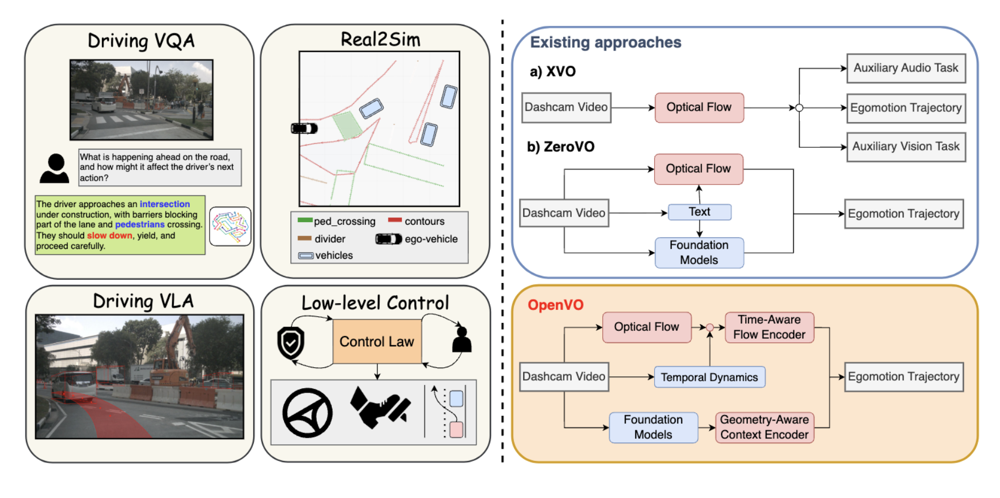

<h1 align="center">
  OpenVO: Open-World Visual Odometry with Temporal Dynamics Awareness
</h1>

:oncoming_automobile: This is the official GitHub repository of the paper:

**[OpenVO: Open-World Visual Odometry with Temporal Dynamics Awareness](https://openvo.github.io/)**
</br>
[Phuc Nguyen](https://phucnda.github.io/),
[Anh Nhu](https://github.com/anh-nn01/),
[Ming Lin](https://www.cs.umd.edu/~lin/)
</br>
*CVPR 2026*

### [Project Page](https://openvo.github.io/) | [Arxiv](https://arxiv.org/abs/2602.19035) | [Video](https://www.youtube.com/watch?v=83LLeMC3vuc)



 **OpenVO**, a novel framework for Open-world Visual Odometry (VO) under **limited input conditions**.

Details of the model architecture and experimental results can be found in [our paper](https://arxiv.org/abs/2602.19035)
```bibtext
@article{nguyen2026openvo,
  title={OpenVO: Open-World Visual Odometry with Temporal Dynamics Awareness},
  author={Nguyen, Phuc DA and Nhu, Anh N and Lin, Ming C},
  journal={arXiv preprint arXiv:2602.19035},
  year={2026}
}
```
**Please CITE** our paper whenever this repository is used to help produce published results or incorporated into other software.


## Features :mega:
* State-of-the-art performance on metric-scale zero-shot visual odometry!
* Support KITTI, nuScenes, Argoverse2 and many MORE!
* Reproducibility code for the community!
* Continuous maintenance/improvement for stronger version!

## Installation guide :hammer:

 Please refer to [installation guide](docs/INSTALL.md)

## Data preparation :open_file_folder:

 Please refer to [data preparation](docs/DATA.md)


## Inference :zap:
Adjust the paths accordingly in ```my_inference.py```:
```
root = './data'
weights = './weights/OpenVO/openvo_nusc_gt'
save_path = "./results"
```
Run
```bash
python src/my_inference.py --config configs/openvo.py
```

If you have multiple GPUs, toggle ```nprocess=$NUM_GPUs$``` and ```devices=[0,1,2,...$NUM_GPUs$-1]``` in ```main()```. This would launch multiprocess with shared CPU/RAM for mass inference.

For visualization, toggle the ```visualizer``` on.

## Evaluation :abacus:

Run
```
cd ./odom-eval
python eval.py
```

The results will be saved under ```./odom-eval/evaluation_results```

Adjust the paths in ```eval.py``` accordingly:
```
eval_dirs = [
            "openvo_nusc_gt"
            ]
result_dir_openvo = '../results'
```
Note on Argoverse2_Stereo only: All results reported in the paper were obtained using models trained with ground-truth intrinsics from stereo videos. The corresponding numerical results are available in ./odom-eval/evaluation_results.
```
ARGO2_Stereo: 12.59, 2.63, 7.71, 0.13 KITTI_X: 9.06, 3.45, 96.24, 0.06 NUSC_X: 9.04, 3.86, 5.90, 0.10
```
## Training :red_car:
After preparing the data, train the model.

Single GPU training:
```bash
python src/main.py --config configs/openvo.py
```
Check your log while training...(there would be no on-screen display)


## TODO :memo:
Please keep an eye out for the regular update!
Status | Name | Date
:---:| --- | ---
✅| OpenVO [project page](https://openvo.github.io/) launched | 2025-11-30
✅| OpenVO accepted at [CVPR 2026](https://cvpr.thecvf.com/) | 2026-02-21
✅| Release OpenVO repository with paper's pretrained weight | 2026-05-13
⬜️| Release ✅ [KITTI](https://huggingface.co/datasets/PhucDucAnhNguyen/OpenVO_KITTI/) ✅ [nuScenes](https://huggingface.co/datasets/PhucDucAnhNguyen/OpenVO_NuScene/) ⬜️ Argoverse2 precomputed dataset | 2026-05-23 
✅| Release [OpenVO-Heavy-v1](https://drive.google.com/drive/folders/1U3PT-ee2Vnat30BqwBkfNnupkhyKaLZF?usp=sharing) (trained on full nuScenes, KITTI, Argoverse2) -- good rotation | 2026-05-23
⬜️| Support more Autonomous Driving datasets (WOMD, P-AV-nvidia,...) | 
⬜️| Distributed training (on going...) | 
